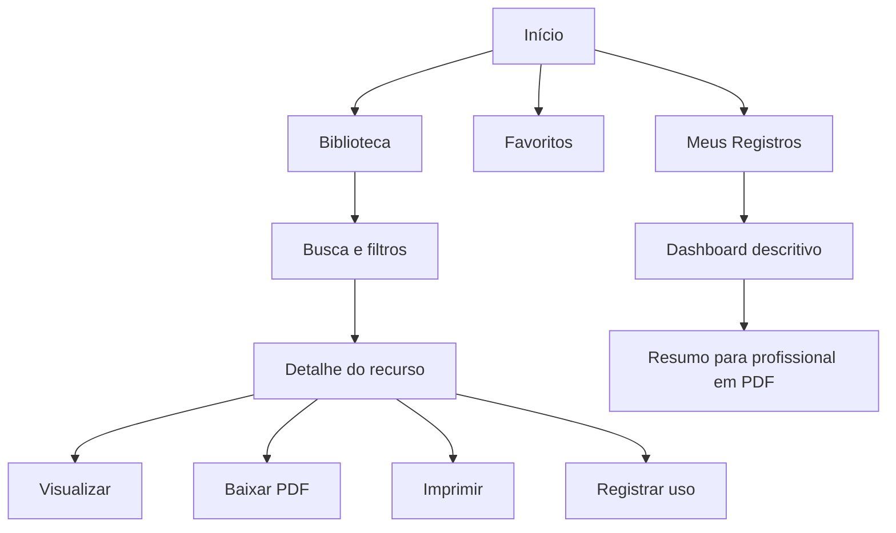

# Biblioteca Rotina TEA — Primeira entrega

**Status:** portão de aprovação. O aplicativo completo ainda não foi iniciado.

Esta entrega organiza o acervo existente, estabelece o contrato de dados e define os cinco recursos piloto. Nenhum texto clínico, diagnóstico, recomendação ou conclusão foi criado.

## 1. Inventário dos materiais existentes

| Coleção | Páginas PNG | PDF associado |
|---|---:|---|
| Kit Planner Rotina TEA | 22 | Kit-Planner-Rotina-TEA.pdf |
| Caderno das Emoções TEA — material adicional já criado | 9 | Bonus-01-Caderno-das-Emocoes-TEA.pdf |
| Bônus 1 — Guia dos Pais | 12 | Bonus-01-Guia-dos-Pais.pdf |
| Bônus 2 — Cartões de Comunicação | 5 | Bonus-02-Cartoes-de-Comunicacao.pdf |
| Bônus 3 — Quadro Primeiro → Depois | 6 | Bonus-03-Quadro-Primeiro-Depois.pdf |
| Bônus 4 — Rotina por Ambientes | 7 | Bonus-04-Rotina-por-Ambientes.pdf |
| Bônus 5 — Calendário Visual | 6 | Bonus-05-Calendario-Visual.pdf |
| **Total** | **67** | **7 PDFs** |

O inventário granular, com um registro para cada arte e seu PDF, está em `content/inventario-materiais.json`. Os JSONs antigos do projeto foram marcados como estruturas legadas: estavam vazios ou continham pilotos divergentes das artes finais e, por isso, não foram aceitos como fonte de conteúdo.

## 2. Campos que já possuem conteúdo aprovado

| Campo | Origem aprovada nesta etapa |
|---|---|
| `id` | Derivação técnica estável do arquivo, sem alterar conteúdo editorial |
| `titulo` | Texto visível na arte final |
| `categoria` | Classificação factual por coleção e finalidade explícita do material |
| `tags` | Apenas palavras explicitamente presentes nos cinco pilotos |
| `arquivoVisual` | PNG final existente |
| `arquivoImpressao` | PDF final existente |
| `produtoOrigem` | Pasta e PDF do produto/bônus correspondente |
| `descricaoAprovada` | Somente frase impressa na arte piloto |
| `situacoesDeUso` | Somente situações listadas na arte piloto |
| `instrucoesDeUso` | Transcrição das instruções impressas na arte piloto |
| `aviso` | Somente observação ou aviso impresso na arte piloto |
| `fonteDoConteudo` e `fontesPorCampo` | Caminho identificável da arte final usada como fonte |

## 3. Campos ainda sem conteúdo aprovado

- `faixaEtaria`: não consta de forma comprovável nas artes selecionadas.
- `camposParaObservar`: não há conteúdo aprovado nos cinco pilotos.
- `informacoesParaCompartilhar`: não há conteúdo aprovado nos cinco pilotos.
- Descrição, situações, instruções e aviso permanecem vazios nos recursos em que a arte não apresenta esses textos.
- A transcrição detalhada dos outros 62 recursos só será feita depois da aprovação deste modelo.

Na interface, qualquer ausência será exibida como **“Informação não cadastrada.”** Listas vazias não serão transformadas em sugestões automáticas.

## 4. Schema JSON

O contrato está em `content/recurso.schema.json`. Ele exige todos os campos estruturais, aceita `null` ou lista vazia quando não há conteúdo aprovado, restringe categorias e proíbe propriedades extras.

Cada recurso também possui:

- `fonteDoConteudo`: fonte principal obrigatória;
- `fontesPorCampo`: fonte obrigatória para cada campo textual preenchido.

O validador `scripts/validate-first-delivery.mjs` rejeita texto preenchido sem fonte, categoria fora da lista, arquivo inexistente e chaves clínicas ou conclusões automáticas.

## 5. Mapa de navegação

Navegação principal: **Início, Biblioteca, Favoritos e Meus Registros**. Em celular, esses destinos passam para navegação inferior; a busca continua próxima ao topo.

## 6. Wireframes das telas principais

### Início

| Ordem | Desktop | Mobile |
|---:|---|---|
| 1 | Cabeçalho com marca, busca e navegação | Marca, botão de busca e menu compacto |
| 2 | Hero com “Biblioteca Rotina TEA” e “Tudo o que você precisa para organizar, apoiar e acompanhar.” | Mesmo texto em uma coluna |
| 3 | Categorias em grade | Categorias em carrossel ou duas colunas |
| 4 | “Recursos mais usados” | Lista horizontal de cards |
| 5 | “Recentes” e “Favoritos” | Seções empilhadas |
| 6 | “Comece por aqui” com três passos | Três passos verticais |

### Biblioteca

| Área | Estrutura |
|---|---|
| Topo | Título, busca por texto e total de resultados |
| Filtros | Categoria, tags e produto de origem; lateral no desktop e gaveta no mobile |
| Resultado | Cards com miniatura real, título, categoria, tags factuais e botão “Abrir recurso” |
| Estado vazio | “Informação não cadastrada.” quando o filtro exigir metadado ausente |

### Detalhe do recurso

| Coluna de visualização | Coluna de informação |
|---|---|
| Prévia real da arte | Título, categoria e produto de origem |
| Botões “Visualizar”, “Baixar PDF” e “Imprimir” | Descrição aprovada, situações, instruções, observação e aviso |
| Controle de página quando aplicável | Favoritar e “Registrar uso” |

### Formulário “Registrar uso”

| Bloco | Campos factuais |
|---|---|
| Identificação | Criança, data, recurso usado e contexto selecionado pelo usuário |
| Registro | Observação livre escrita pelo usuário e campos aprovados do recurso |
| Ações | Salvar localmente, cancelar e excluir com confirmação |

O formulário não calcula diagnóstico, evolução, eficácia, gravidade, prognóstico, tratamento, sintomas ou recomendações.

### Dashboard descritivo

| Bloco | Conteúdo permitido |
|---|---|
| Filtros | Período, recurso e contexto |
| Métricas | Contagem de usos e distribuição por recurso/contexto |
| Histórico | Registros factuais em ordem cronológica |
| Exportação | “Gerar resumo para profissional” |

### Resumo para profissional em PDF

| Página | Conteúdo |
|---:|---|
| 1 | Identificação fornecida pelo usuário, período e lista de recursos usados |
| 2+ | Datas, contextos, contagens e observações digitadas, sem interpretação |
| Final | Aviso: “Este resumo organiza registros factuais e não substitui avaliação profissional.” |

## 7. Lista de componentes

| Componente | Responsabilidade |
|---|---|
| `AppHeader` / `MobileNav` | Navegação global responsiva |
| `GlobalSearch` | Busca apenas em campos aprovados |
| `CategoryCard` | Card de categoria com cor e ícone coerentes com o kit |
| `ResourceCard` | Miniatura real, título, categoria e ação de abertura |
| `FilterPanel` | Filtros por categoria, tag e origem |
| `ResourcePreview` | Visualização da arte ou página selecionada |
| `ApprovedContentSection` | Renderização literal dos campos aprovados |
| `MissingInformation` | Fallback “Informação não cadastrada.” |
| `FavoriteButton` | Favorito salvo no dispositivo |
| `UsageForm` | Registro factual preenchido pelo usuário |
| `RecordsTable` | Histórico sem interpretação |
| `DescriptiveMetrics` | Contagens e distribuições simples |
| `ProfessionalSummaryBuilder` | PDF factual a partir dos registros |
| `PwaInstallPrompt` | Instalação opcional do aplicativo |

## 8. Proposta de armazenamento

### Versão local inicial

- Conteúdo editorial: JSON estático versionado junto ao aplicativo.
- Preferências, favoritos e recentes: `localStorage`.
- Registros de uso: `IndexedDB`, com versão do schema e identificadores estáveis.
- PDFs e artes: arquivos estáticos versionados; cache offline controlado pelo service worker.
- Resumo em PDF: gerado no dispositivo apenas com registros factuais e textos aprovados.
- Sem login nesta etapa; os registros permanecem no dispositivo do usuário.

### Evolução futura para Supabase

Tabelas propostas: `resources`, `resource_sources`, `profiles`, `favorites` e `usage_records`. A migração deve preservar IDs, datas, autoria do registro e versão do schema. Autenticação e sincronização só entram em fase futura, mediante aprovação específica.

## 9. Regras técnicas anti-invenção

1. Nenhum recurso entra no build sem `fonteDoConteudo`.
2. Todo campo textual preenchido exige uma entrada em `fontesPorCampo`.
3. Campo sem fonte fica `null` ou `[]` e aparece como “Informação não cadastrada.”
4. A interface renderiza texto literal do JSON; não resume, completa ou parafraseia.
5. Busca e filtros indexam somente campos aprovados.
6. Categorias obedecem a uma lista fechada no schema.
7. O build falha se uma imagem ou PDF associado não existir.
8. Chaves clínicas, interpretações e conclusões automáticas são proibidas pelo validador.
9. O dashboard calcula apenas contagens e distribuições descritivas.
10. O PDF profissional reproduz registros factuais; não produz recomendação.
11. Toda alteração editorial exige nova fonte identificável e revisão do schema.
12. Conteúdo legado divergente não é promovido automaticamente para a biblioteca.

## 10. Cinco recursos piloto

| Piloto | Categoria | Fonte visual | Aspecto validado |
|---|---|---|---|
| Antes de Começar | Guia dos Pais / Rotinas | `bonus-01-guia-dos-pais/02-antes-de-comecar.png` | Subtítulo, instruções e aviso |
| Como Usar os Cartões | Comunicação Visual | `bonus-02-cartoes-comunicacao/02-como-usar.png` | Situações, instruções e observação |
| Como Usar Quadro Primeiro → Depois | Primeiro e Depois | `bonus-03-primeiro-depois/02-como-usar.png` | Sequência, contextos e aviso |
| Rotina de Passeio | Rotinas por Ambiente / Rotinas | `bonus-04-rotina-ambientes/05-passeios.png` | Recurso sequencial imprimível |
| Como Usar o Calendário Visual | Calendário Visual | `bonus-05-calendario-visual/02-como-usar.png` | Eventos, instruções e aviso |

Os registros completos estão em `content/recursos-piloto.json`.

## Portão de aprovação

Para iniciar a implementação do aplicativo, precisam ser aprovados: o schema, o fallback para campos ausentes, as categorias, os wireframes e os cinco pilotos acima. Até essa aprovação, os outros 62 recursos permanecem apenas inventariados.
